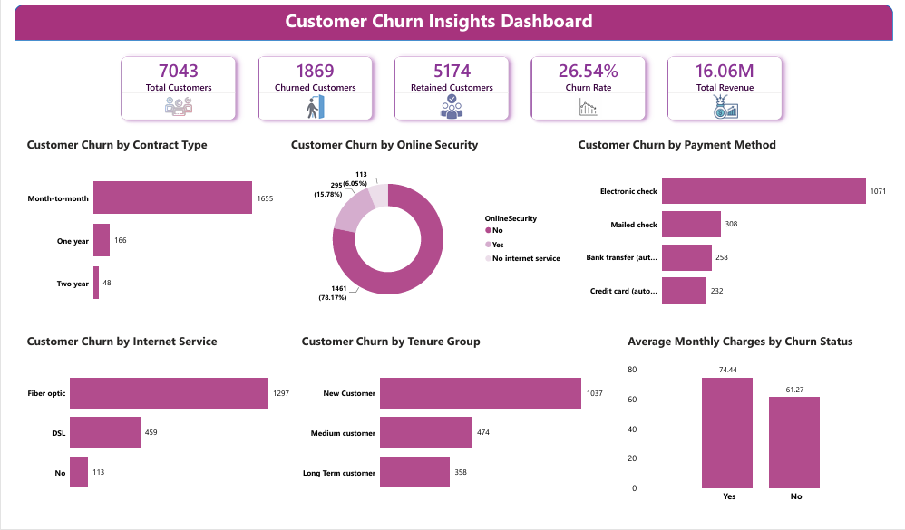

# 📊 Customer Churn Analysis Dashboard

## 📌 Project Overview

Developed an interactive Customer Churn Analysis Dashboard using **SQL**, **Power BI**, and **DAX** to analyze customer behavior and identify the key factors influencing customer churn. SQL was used for data exploration and validation, while Power BI and DAX were used to create business KPIs and interactive visualizations.

---

## 🛠️ Tools & Technologies

- SQL (MySQL)
- Power BI
- DAX

---

## 📈 Dashboard Preview

---

## 📊 Key Performance Indicators (KPIs)

- Total Customers
- Churned Customers
- Retained Customers
- Churn Rate
- Total Revenue
- Revenue Lost
- Average Monthly Charges

---

## 📊 Dashboard Features

- Customer Churn by Gender
- Customer Churn by Senior Citizen
- Customer Churn by Contract Type
- Customer Churn by Internet Service
- Customer Churn by Payment Method
- Customer Churn by Online Security
- Customer Churn by Tenure Group
- Monthly Charges Analysis
- Executive KPI Cards

---

## 📐 DAX Measures

- Churn Rate
- Churned Customers
- Retained Customers
- Total Revenue
- Revenue Lost
- Average Monthly Charges

---

## 🔍 Key Business Insights

- Customers with Month-to-Month contracts have the highest churn.
- Fiber Optic internet customers show a higher churn rate.
- Customers without Online Security are more likely to churn.
- Electronic Check is the payment method with the highest churn.
- Customers with higher monthly charges tend to churn more frequently.

---

## 📂 Repository Contents

- Customer_Churn_Analysis.pbix
- Dashboard.png
- README.md
